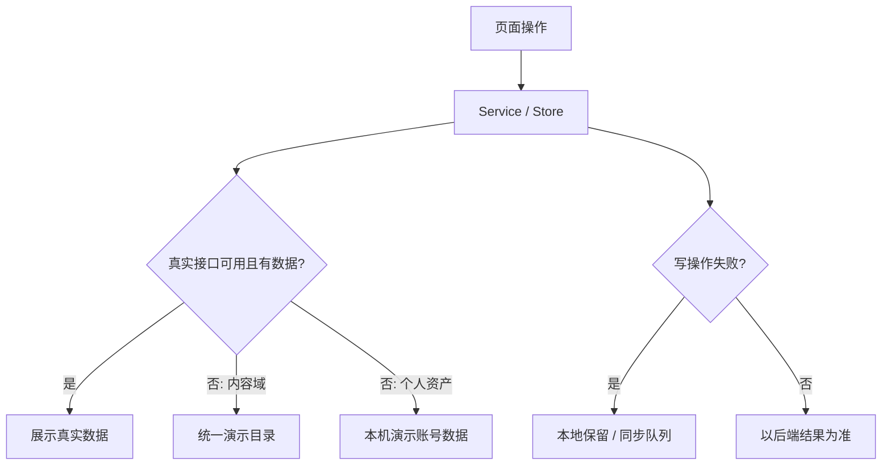

# 三坑绮橱全项目扫描、前后端契约与前端补全报告

> 扫描日期：2026-09-04  
> 前端基线：`6b06d0d`（`fix(sync): R0 同步与提醒一致性修复`）  
> 后端基线：`cb5e6c1`（`feat(api): 2026-09-02 全量后端同步`）  
> 产品依据：Product Review 2.0、PRD V1、Design Language V2、Product V2 Baseline、Phase 0 Technical Spike

## 1. 执行结论

项目不是“多数功能完全不存在”，而是此前存在三类错位：

1. 后端已有真实接口，但前端仍使用静态 Mock 或空壳，例如榜单、趋势、通知、反馈、版本检查、社区详情和搜索高级筛选。
2. 前后端都实现了个人数据同步，但后端 Zod Schema 会剥离前端的来源关系字段，导致购买、衣橱、提醒的关联数据静默丢失。
3. 页面入口齐全，但部分入口没有闭环，例如收藏的“穿搭/合集”、FAQ、资料编辑、社区分页/详情/举报、预算设置。

本轮已完成所有当前可由前端独立完成、且不改变产品边界的功能补全，并对必要的后端契约做了兼容修复。数据策略统一为：

Mock 数据均使用稳定 ID、本地图片，并明确标注“演示数据/演示内容”；不会伪装为真实运营指标或真实云端提交。

## 2. 整体项目现状总览

| 维度 | 当前判断 | 说明 |
|---|---|---|
| 产品定位 | 基本一致 | 核心仍是“想买 → 购买 → 尾款/到货 → 入橱 → 提醒”的个人消费管理闭环；社区保持轻量穿搭灵感，不扩张为完整社交平台。 |
| 前端架构 | 可继续迭代 | uni-app x / UTS / Vue 3，页面、Store、Repository、Service、Presenter 分层已经形成；仍有少量旧命名和重复兼容字段。 |
| 后端架构 | 已具备 Beta 基础 | Fastify + PostgreSQL + 对象存储，公开内容、个人资产、同步、上传、AI 订单识别、反馈与版本接口齐全。 |
| 真实接口覆盖 | 较高 | Feed、搜索、趋势、商品、品牌、榜单、日历、社区、个人资产、预算、偏好、通知、AI 导入均有接口。 |
| 离线与失败降级 | 已补齐主链路 | 内容域远端优先、无数据或不可达时统一 Mock；个人资产仅在本机演示账号种入样例；写失败进入同步队列或保留本地副本。 |
| 数据一致性 | 核心问题已修 | R0 同步/提醒修复已在基线；本轮补齐购买来源链路、衣橱来源、全天提醒和衣橱绑定字段。 |
| UI 一致性 | 基本统一 | 新页面继续使用现有 DetailLayout、MainLayout、PageState、PostCard、FormSection、BottomActionBar 和 V3 Token。 |
| 自动化质量 | 后端通过，前端源码门禁通过 | 后端 TypeScript 类型检查通过，全部可运行测试通过；前端运行时、Android、V3、R0 源码门禁通过。 |
| 构建验证 | 尚缺 HBuilderX 编译 | 当前 Linux 环境没有 HBuilderX，无法生成 `unpackage/dist/dev/mp-weixin/app.js`；不能据此宣称微信小程序编译已通过。 |
| 发布准备度 | 不可直接正式发布 | 法务运营常量仍有待填项；微信登录、OCR 服务、OSS/PostgreSQL 需在真实环境联调；需要小程序与 Android 真机回归。 |

## 3. 前后端配合检查

### 3.1 已完成配合的接口

| 业务 | 后端接口 | 前端状态 |
|---|---|---|
| 首页内容 | `GET /api/v1/feed` | 真实接口优先；首屏空/失败使用统一演示目录；游标分页保持真实语义。 |
| 搜索 | `GET /api/v1/search` | 已接关键词、坑向、发售状态、价格区间和游标分页。 |
| 趋势 | `GET /api/v1/trends` | 已从 Feed 假推导改为读取真实趋势；空数据使用演示趋势。 |
| 商品/款式 | `GET /products/:id`、`/styles/:id` | 商品详情、批次、价格语义和买家内容已接；商品空/失败有一致 Mock。 |
| 品牌 | `/brands`、`/brands/:id`、`/brands/:id/products` | 真实优先、演示降级；关注使用真实接口。 |
| 榜单 | `GET /api/v1/ranking` | 已移除页面静态榜单，接真实 hot/new；无数据用统一演示目录。 |
| 发售日历 | `GET /api/v1/calendar` | 真实优先；日历日期可打开当日发售并创建提醒。 |
| 社区 | `/community/posts`、详情、发布、点赞、删除 | 已补分页、独立详情、点赞、关联商品和本机演示发布。 |
| 个人资产 | `/me/wardrobe`、`purchases`、`reminders`、`wishes` | CRUD、离线保留、写回队列已存在；本轮修正字段剥离。 |
| 收藏决策 | `/wishlist`、品牌关注 | 商品收藏、待购状态、批次、提醒、购买流转已形成闭环。 |
| 预算/偏好 | `/me/budget`、`/me/preferences` | 预算额度、进度、阈值和价格偏好已补 UI 与持久化。 |
| 通知 | `/me/notifications`、`notifications:generate` | 已由静态 Mock 改为登录后真实生成/拉取/标记已读，失败显示演示通知。 |
| 图片与 AI 订单导入 | `/uploads:*`、`/ai/import-tasks` | 真实账号支持上传、轮询草稿、用户确认后建单；演示账号明确引导手填，不伪造 OCR。 |
| 反馈与版本 | `/feedback`、`/app/version` | 已接真实接口；反馈失败保留本地副本，版本失败回退当前版本。 |

### 3.2 本轮修复的静默丢字段

| 资产 | 原问题 | 修复字段 |
|---|---|---|
| Purchase | 前端发送关系字段，后端 Schema 未声明并自动剥离 | `remainingCents`、`wishId`、`wardrobeId`、`productId`、`releaseId` |
| Wardrobe | 从购买/心愿转入衣橱后，远端丢失来源 | `purchaseId`、`wishId` |
| Reminder | 全天提醒及关联衣橱在远端丢失 | `isAllDay`、`wardrobeBindings` |

### 3.3 后端仍未提供的能力

这些能力不能仅靠前端“假接成功”，本轮使用透明降级或暂不开放：

| 能力 | 当前前端处理 | 需要的后端工作 |
|---|---|---|
| 社区举报 | 本机记录为 `PENDING_MOCK_REVIEW`，明确提示“演示审核队列” | 举报创建、幂等、审核状态、风控与申诉 API。 |
| 用户资料修改 | 昵称/头像仅保存在本机，并在页面明确说明 | `PATCH /api/v1/me`、头像上传/引用、版本冲突策略。 |
| 收藏自定义合集 | 当前按待购状态自动形成智能合集 | 合集实体、排序、增删成员、跨端同步接口。 |
| 通知分类偏好 | 本机持久化总开关与分类开关 | 用户通知偏好 Schema、推送订阅、服务端过滤。 |
| 专题实体 | 专题页使用统一演示商品目录 | editorial 列表/详情/商品关系/运营发布 API。 |
| 反馈图片 | 文字真实提交，临时截图只留本机 | 反馈附件上传用途、mediaId 关联及后台查看。 |
| 客服/运营后台 | 前端仅提供邮箱与反馈 | 工单、客服处理、内容审核和运营配置后台。 |

## 4. 逐模块评估与业务调研要点

| 模块 | 已实现部分 | 残缺部分 | 完全缺失部分 | 业务调研要点 |
|---|---|---|---|---|
| 首页 / Feed | 频道、坑向偏好、瀑布流、收藏、真实 Feed、分页、演示降级 | 推荐理由质量依赖后端数据密度 | A/B 实验与推荐运营配置 | 首屏打开原因、推荐命中率、收藏转化、低数据用户冷启动。 |
| 发现 / 趋势 / 榜单 | 品牌、专题、日历、趋势、热榜/上新榜均可用 | 专题仍为 Mock 实体；趋势数据稀疏时解释有限 | 专题 CMS | 用户更关心“怕错过发售”还是“被种草”；榜单排序是否按收藏、成交或热度。 |
| 搜索 | 关键词、历史、编辑推荐、坑向/状态/价格筛选、分页 | 品牌独立筛选 UI、联想词、搜索纠错未做 | 搜索分析后台 | 高频查询词、中文/英文/别名映射、无结果率、筛选使用率。 |
| 商品详情 | 多图、价格语义、批次、发售状态、官方链接、收藏、提醒、记购买、买家内容 | 真实商品字段完整度和链接质量依赖采集 | 价格历史图、库存真实性 SLA | 用户最需要价格、定金/尾款、截团、再贩还是尺码；来源可信度如何展示。 |
| 品牌 / 款式 | 品牌目录/详情/商品、关注、款式后端实体 | 前端尚无独立款式详情入口 | 品牌认证、运营维护 | 品牌 ID 合并、别名、官方渠道验证、品牌方纠错流程。 |
| 收藏 / 心愿决策 | 商品、品牌、喜欢的穿搭、智能合集；待购状态；发售提醒；转购买 | 自定义合集与跨端排序无后端 | 自定义合集实体 | 收藏后用户下一步是等发售、等降价还是直接购买；状态迁移是否符合真实习惯。 |
| 购买 / 尾款 | CRUD、状态流转、金额、尾款/到货提醒、预算、来源商品、AI 截图导入 | 退款、部分退款、分批到货未建模 | 对账与账单导出 | 定金/尾款/补款的真实组合、取消/退款、团长单、二手交易如何记录。 |
| 提醒 | 自定义、发售、尾款、到货；本地系统通知；订单联动；完成/错过状态 | 服务端推送和跨设备时区未联调 | 推送任务后台 | 用户希望提前多久、免打扰、重复提醒、错过后的补救行为。 |
| 衣橱 | 分类、编辑、图片、穿着状态、购买来源、统计 | 图片云端生命周期与去重需真机/OSS 联调 | 搭配组合实体、穿着日历 | 入橱成本、最少必填字段、闲置判断、出物/赠送/损耗状态。 |
| 圈子 / 穿搭 | 灵感流、筛选、分页、详情、发布、点赞、拉黑、关联商品、本机举报记录 | 举报无后端；评论被产品策略明确排除 | 审核/申诉后台 | 轻量 Gallery 是否足够；内容安全规则；发布意愿和图片隐私。 |
| 预算 / 消费日志 | 月预算、已承诺/已支付/待支付、进度、阈值提醒 | 多月趋势与预算结转未做 | 导出/年度报告 | 用户以“下单总额”还是“本月实际支付”衡量预算；定金跨月如何归属。 |
| 通知中心 | 云端生成/列表/已读；演示降级；分类设置本机保存 | 服务端分类偏好和真实 Push 未完成 | 推送运营后台 | 哪些消息必须推、频率上限、免打扰、点击后的业务落点。 |
| 账号 / 设置 | 微信登录、本机演示账号、资料本机编辑、外观、偏好、黑名单、缓存、隐私与法务入口 | 资料编辑没有云端接口；本地资产键未完全按账号命名空间隔离 | 注销、导出、账号合并 API | 微信授权接受度、换机迁移、注销/导出、游客数据并入账号的规则。 |
| 帮助 / 反馈 / 版本 | FAQ 展开、客服邮箱复制、真实反馈提交、本地失败副本、真实版本检查 | 反馈附件无后端上传；客服流程未建立 | 工单状态查询 | 高频问题、响应时效、反馈是否需要回访和处理进度。 |
| AI 导入 | 真实账号上传订单截图、服务端 OCR 草稿、轮询、人工确认、建单回执 | OCR 供应商与真实数据准确率待验证 | 多图合并、自动纠错学习闭环 | 字段准确率门槛、低置信字段提示、隐私保存时长、失败后手填转化。 |
| 同步 / 离线 | 稳定客户端 ID、写失败入队、401 刷新、409/404 幂等、不可重试存档 | 多账号本地数据隔离仍需系统改造 | 冲突可视化与恢复中心 | 同一账号多设备冲突、游客转登录、失败队列是否需要用户可见。 |

## 5. 本轮已开发 / 补全清单

### 内容域

- 新增统一 Mock Catalog，集中管理商品、品牌、Feed、榜单和日期样例，消除页面各自造假。
- Feed、搜索、品牌、商品、榜单、日历统一改为“真实接口优先、首屏空或失败再降级”。
- 发现页接入真实趋势接口；趋势条目可跳品牌、商品或话题。
- 榜单移除无后端语义的 7/30 天假筛选，保留后端支持的 hot/new。
- 搜索补齐坑向、发售状态、价格筛选并传递到后端。
- 专题详情在后端尚无专题实体时使用统一演示商品，保证专题到详情可走通。

### 用户资产与消费闭环

- 预算页接入 Budget Store，支持月预算设置、调整、进度和 70/80/90/100% 阈值。
- 偏好页增加价格区间；首页本地/Mock Feed 同样遵守价格偏好。
- 购买记录新增 `productId/releaseId`，商品详情和收藏转购买时保留来源。
- 购买详情新增“查看来源商品”。
- 本机演示账号自动生成衣橱、购买、提醒、心愿、收藏和关注品牌样例。
- 收藏“穿搭”展示点赞内容；“合集”按待购状态形成可点击的智能合集。

### 社区、通知与设置

- 社区公开流支持后端游标分页、独立详情、点赞、关联商品和加载更多。
- 后端没有举报 API 时本机记录举报，并明确展示为演示审核队列。
- 通知中心登录后调用生成/列表/已读接口，失败时降级演示通知。
- 通知总开关和四类分项设置均可持久化。
- 用户资料新增本机编辑页，并明确云端接口尚未提供。
- FAQ 从“功能开发中”改为可展开答案；客服邮箱可复制。
- 反馈和版本检查改用真实后端接口；商品官方渠道在 App 端直接打开。

### 后端契约与工程质量

- 补齐 Purchase、Wardrobe、Reminder 的前端关系字段，避免 Zod 静默剥离。
- PostgreSQL JSON 参数改用驱动原生 JSON 序列化，修复 9 个 TypeScript 错误。
- OSS SDK 改为首次真实 I/O 时懒加载，避免内存/URL 测试因网卡枚举失败。
- 新增个人资产契约测试，覆盖购买来源、衣橱来源、全天提醒和衣橱绑定。

## 6. 待开发 / 补全功能完整清单

### P0：正式联调与数据安全

1. 增加本地存储账号命名空间，解决同一设备多个真实账号间的缓存短暂串读风险。
2. 在真实 PostgreSQL、OSS、OCR、微信登录环境执行端到端联调。
3. 用 HBuilderX 编译微信小程序与 Android，完成真机上传、通知、外链、相册/相机回归。
4. 填写法务/运营常量并在 `LEGAL_RELEASE=1` 门禁下验证。
5. 为社区举报、用户资料修改、通知偏好补齐后端 API。

### P1：核心留存闭环

1. 自定义收藏合集及跨端同步。
2. 专题实体和运营发布能力，替换专题 Mock。
3. 推送任务、免打扰和服务端通知分类过滤。
4. 退款/部分退款/取消后的预算和提醒联动。
5. AI OCR 真实样本评估、字段置信度 UI、失败原因分类和数据保留策略。
6. 反馈附件上传及处理状态。

### P2：效率与洞察

1. 搜索联想、品牌筛选、别名/纠错与无结果分析。
2. 预算月度趋势、跨月定金/尾款归属规则和年度报告。
3. 衣橱搭配组合、穿着记录、闲置提示。
4. 价格历史、降价原因和来源可信度。
5. 同步失败恢复中心与冲突可视化。

### P3：有验证后再做

1. 更复杂的推荐实验平台。
2. 品牌认证与品牌方自助纠错。
3. 数据导出、账号合并和跨设备迁移助手。

不建议投入完整评论、私信、关注流或泛社区 Timeline；这与 Product Review 2.0 的“个人发现引擎 + 轻量穿搭 Gallery”边界冲突，也会把有限资源从消费管理主闭环移走。

## 7. 迭代优先级建议

| 阶段 | 建议周期 | 目标 | 验收标准 |
|---|---:|---|---|
| R1 联调封板 | 1–2 周 | 完成 P0 真环境联调和账号隔离 | 微信登录、资产 CRUD、离线恢复、OSS 图片、OCR、通知在真机通过；无跨账号串读。 |
| R2 留存闭环 | 2–3 周 | 补举报/资料/通知偏好/合集/专题 | 当前所有透明 Mock 点均有可替换后端契约；运营能独立维护专题。 |
| R3 交易完整性 | 2 周 | 退款、取消、跨月预算与提醒 | 典型定金/尾款/退款用例账实一致，无孤儿提醒。 |
| R4 数据驱动 | 持续 | 搜索、推荐、OCR、通知优化 | 建立无结果率、收藏转购买率、提醒点击率、OCR 字段准确率和 7/30 日留存指标。 |

优先级判断原则：先保证用户资产不丢、不串、可恢复；再提升“怕错过”和“消费管理”留存；最后才扩展内容和增长能力。

## 8. 验证结果与已知限制

| 检查项 | 结果 |
|---|---|
| 后端 `npm run typecheck` | 通过 |
| 后端 Vitest | 23 个测试文件、225 条用例通过；1 个文件/1 条用例按环境条件跳过 |
| 前端 runtime contract | 通过 |
| 前端 Android source gate | 通过 |
| 前端 V3 source gate | 通过；法务运营常量有发布前警告 |
| 前端 R0 sync/reminder consistency | 21/21 通过 |
| `git diff --check` | 通过 |
| 微信小程序编译 | 当前环境无 HBuilderX，未执行；`npm run check` 仅因此缺少编译产物而失败 |

## 9. 发布前验收清单

- [ ] HBuilderX 编译 mp-weixin，运行 `npm run check:mp-weixin` 和完整 `npm run check`。
- [ ] Android Debug/Release 构建及真机启动、深色主题、返回栈、外链测试。
- [ ] 微信登录、Token 刷新、退出/换账号、本地队列冲刷测试。
- [ ] PostgreSQL 环境跑 migration、启动、ready probe 和 CRUD 冒烟。
- [ ] OSS 上传公开/私有前缀、媒体读取与删除测试。
- [ ] OCR 任务 pending → processing → ready/failed → confirm 全链路测试。
- [ ] 个人资产字段往返后保持 `wishId/productId/releaseId/wardrobeId/isAllDay/wardrobeBindings`。
- [ ] 真实接口空数据、5xx、超时、401、离线恢复场景回归。
- [ ] 法务主体、隐私政策、用户协议、客服邮箱和版本下载地址由运营确认。
