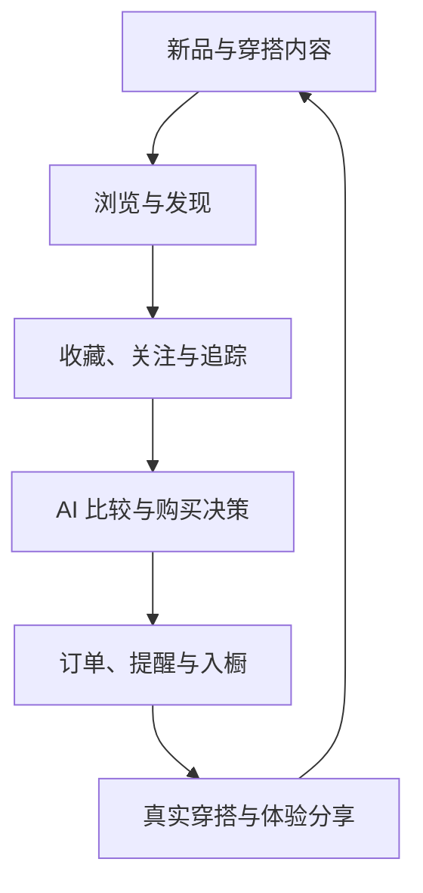
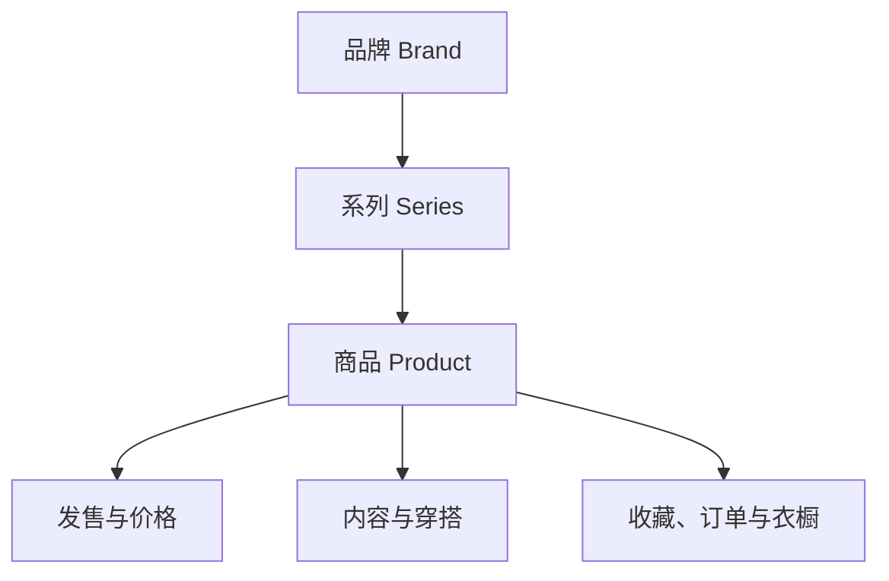

# 《三坑绮橱 Product V2 产品蓝图》

> 文档类型：产品战略 + 信息架构 + 用户体验 + 增长路线图  
> 产品代际：Product V2  
> 文档版本：1.0  
> 日期：2026-07-14  
> 适用范围：未来 6 个月产品、设计、内容、AI、数据与工程决策

---

## 0. 执行摘要

### 0.1 最终结论

三坑绮橱需要从“衣橱与消费管理工具”重构为：

> **面向 JK、Lolita、汉服用户的三坑兴趣消费决策平台：帮助用户发现心动、判断是否值得、持续追踪、安心购买、管理拥有并分享穿搭。**

内容是日常打开理由，收藏是意图沉淀，AI 是决策放大器，订单/提醒/衣橱是产品区别于普通内容社区的闭环能力。

新的价值链不是：

> 打开工具 → 看统计 → 手动管理

而是：

> 看到内容 → 产生兴趣 → 收藏追踪 → 比较决策 → 购买提醒 → 到货入橱 → 穿搭分享 → 反哺推荐

### 0.2 必须推翻的旧结论

| 旧结论 | Product V2 决策 | 原因 |
|---|---|---|
| 首页是 Dashboard | 删除 Dashboard 首页定位，改为个性化内容 Feed | 数据面板没有日常打开理由 |
| Wardrobe / Purchase 是一级导航 | 下沉至“我的 > 管理中心”并保留情境入口 | 管理是闭环能力，不是内容产品的第一心智 |
| Discovery 可以延期或取消 | “发现”成为一级导航 | 没有发现就没有消费前链路与日活 |
| 永远不做 Feed | 改为做“商品与穿搭中心化的高质量 Feed” | Product V2 的核心就是内容供给，但必须控制噪音 |
| AI 只是 OCR/隐形助手 | AI 同时承担推荐、理解、比较、搭配与管理，拥有一级入口 | AI 是差异化决策能力，不是单个导入功能 |
| 不做社区 | 不做泛社交，但做围绕商品、品牌、系列和穿搭的结构化社区 | 分享和真实体验是内容生态的重要供给 |
| 不做商业链路 | 前期不自营、不闭环支付，但允许官方购买跳转、联盟佣金和品牌合作 | 用户的“购买”需求需要被承接，但不承担供应链风险 |

### 0.3 应继续保留的旧资产

- WishList 状态机及“想要 → 已购买”的流转思想。
- Purchase 的定金、尾款、工期、状态管理。
- Reminder 的预约、开售、尾款、到货提醒能力。
- Wardrobe 的结构化衣物数据与搜筛能力。
- OCR、链接解析和截图导入的基础能力。
- 本地数据、导出、隐私优先的产品信任原则。

这些能力不再决定首页长什么样，但会构成普通内容平台难以复制的“兴趣到拥有”闭环。

---

## 1. 产品定位

### 1.1 Mission

> **让每一次心动，都更容易被发现、被判断、被记住，并最终成为真正适合用户的拥有。**

### 1.2 Vision

> **成为中文三坑用户最可信的内容、决策与个人收藏平台。**

### 1.3 一句话定位

> **三坑绮橱 = 三坑新品与穿搭内容 Feed + 收藏追踪 + AI 消费决策 + 个人绮橱。**

### 1.4 推荐 Slogan

主 Slogan：

> **发现心动，也管好每一次心动。**

备选：

- 今天穿什么，下一件买什么。
- 从种草到入橱，都在三坑绮橱。
- 看见喜欢，买得明白，穿得更好。

### 1.5 产品边界

三坑绮橱要做：

- 三坑垂直内容聚合与个性化推荐。
- 商品、品牌、系列、预约和价格的结构化信息。
- 收藏、关注、价格/发售追踪和购买决策。
- 订单、提醒、衣橱、预算的个人管理闭环。
- 围绕商品与穿搭的结构化分享。
- AI 识别、搜索、推荐、比较、搭配和分析。

三坑绮橱近期不做：

- 自营库存、仓储、支付、售后和物流。
- 无主题的泛娱乐信息流。
- 私信陌生人、群聊等重社交功能。
- 没有证据来源的价格“保证”或品牌信用背书。
- 自动替用户下单或进行不可逆消费操作。

---

## 2. 核心用户与需求分层

### 2.1 首要用户：内容发现型

- 年龄主要在 16–28 岁。
- 经常浏览小红书、微博、淘宝、品牌群等分散渠道。
- 想知道新品、图透、预约、联名和近期热门。
- 痛点不是“没有内容”，而是内容分散、重复、缺少结构化时间和价格信息。
- Product V2 为她提供“一个地方看三坑”的日常价值。

### 2.2 次要用户：理性收藏型

- 被种草频繁，但不会立刻购买。
- 需要收藏夹、系列对比、降价/开售提醒和预算判断。
- Product V2 为她提供从“截图相册”到“可追踪收藏”的迁移理由。

### 2.3 高价值用户：深度管理型

- 已有大量订单与衣物，重视尾款、预算、数据和导出。
- 打开频率未必最高，但数据沉淀和付费意愿更强。
- Product V2 不删除其工具能力，只是不让工具定义全产品。

### 2.4 增长用户：穿搭表达型

- 喜欢看穿搭、发返图、记录搭配。
- 更在乎审美认同和灵感，而不是精细记账。
- 分享内容必须绑定商品、系列或衣橱单品，避免社区变成无结构图片流。

### 2.5 品牌与内容合作方

- 希望发布新品、预约、补款、再贩和联名信息。
- 希望看到收藏、关注和用户兴趣趋势。
- 需要可信身份、结构化发布、数据反馈和清晰商业标识。

---

## 3. 产品增长模型

### 3.1 核心飞轮



### 3.2 产品护城河

普通内容平台知道用户“看过什么”；普通衣橱工具知道用户“拥有什么”。三坑绮橱应该同时理解：

- 用户看过什么。
- 收藏了什么。
- 等待什么发售或降价。
- 买过什么、花了多少。
- 最终拥有什么、穿过什么。
- 什么内容真正从浏览转化成了长期喜欢。

这条跨越“内容—意图—交易—拥有—使用”的数据链，才是个性化推荐、AI 决策和品牌洞察的长期壁垒。

---

## 4. Product V2 信息架构（IA）

### 4.1 一级导航

底部采用 5 个一级目的地：

| Tab | 用户心智 | 核心内容 | 不放什么 |
|---|---|---|---|
| **首页** | 今天有什么值得看 | 推荐 Feed、关注动态、新品、预约、降价、穿搭 | 统计、预算、提醒清单、快捷入口宫格 |
| **发现** | 我想主动找 | 搜索、分类、趋势、品牌、系列、发售日历、专题 | 个性化管理数据 |
| **绮灵 AI** | 帮我看懂和做决定 | 识图、找同款、搭配、比较、预算、收藏分析、导入 | 空白聊天框、纯聊天机器人 |
| **收藏** | 我喜欢和正在等的 | 商品收藏、合集、品牌关注、价格/预约追踪、状态流转 | 已拥有衣橱的完整管理 |
| **我的** | 我的身份、内容和管理 | 主页、发布、订单、提醒、衣橱、预算、设置 | 首页推荐 Feed 的重复副本 |

这一结构符合移动端 3–5 个稳定顶级目的地的常见导航原则；“绮灵 AI”必须是可完成任务的真实页面，而不能只是一个抢眼但空洞的按钮。

### 4.2 为什么管理模块不再是 Tab

Wardrobe、Purchase、Reminder 都属于同一类心智：**我的消费与拥有**。把它们分别设为一级 Tab，会把产品切成多个数据库列表。

Product V2 中它们有两种入口：

1. **情境入口**：商品详情收藏后建立价格提醒；确认购买后生成订单；到货后进入衣橱。
2. **集中入口**：“我的 > 管理中心”统一查看订单、提醒、衣橱、预算和导入导出。

因此管理能力并未被隐藏，而是从“必须先找到一个工具页面”变成“在用户行为发生时自然出现”。

### 4.3 完整页面树

```text
三坑绮橱 Product V2
├─ 首页
│  ├─ 推荐 / 关注 / JK / Lolita / 汉服
│  ├─ 混合内容 Feed
│  ├─ 商品详情
│  ├─ 品牌动态详情
│  ├─ 预约/发售事件详情
│  ├─ 穿搭详情
│  ├─ 专题详情
│  └─ 消息与通知
├─ 发现
│  ├─ 全局搜索
│  ├─ 搜索结果：商品 / 品牌 / 系列 / 穿搭 / 用户
│  ├─ 分类频道：JK / Lolita / 汉服
│  ├─ 趋势榜单
│  ├─ 品牌库与品牌主页
│  ├─ 系列/商品库
│  ├─ 发售日历
│  └─ 编辑专题
├─ 绮灵 AI
│  ├─ 拍照/截图识别
│  ├─ 链接解析
│  ├─ 找同款/相似商品
│  ├─ AI 商品比较
│  ├─ AI 穿搭
│  ├─ AI 预算建议
│  ├─ AI 收藏分析
│  └─ 历史任务与纠错
├─ 收藏
│  ├─ 商品
│  ├─ 合集
│  ├─ 品牌
│  ├─ 穿搭
│  ├─ 追踪：开售 / 再贩 / 降价
│  └─ 状态：心动 / 观望 / 决定 / 已购买 / 拔草
└─ 我的
   ├─ 个人主页：发布 / 穿搭 / 喜欢 / 草稿
   ├─ 创作发布
   ├─ 管理中心
   │  ├─ 订单
   │  ├─ 提醒
   │  ├─ 衣橱
   │  ├─ 穿搭记录
   │  ├─ 预算与消费
   │  └─ 导入 / 导出
   ├─ 浏览历史
   ├─ 会员中心（未来）
   └─ 设置中心
```

### 4.4 全局入口

- 全局搜索：位于首页和发现顶部；支持商品、品牌、系列、用户和自然语言。
- 消息中心：首页右上角；承载品牌更新、开售/降价、互动和系统通知。
- 发布入口：我的主页主按钮，穿搭详情/衣橱也可发起；社区成熟后可评估上浮，但不在 MVP 抢占一级 Tab。
- AI 情境入口：商品详情、收藏、衣橱、订单等页面直接出现“问绮灵”，自动携带当前上下文。
- 快速收藏：所有内容卡片统一支持单击收藏，长按或二级操作选择状态/合集。

---

## 5. 首页内容生态

### 5.1 首页目标

首页只回答三个问题：

1. 今天三坑里发生了什么？
2. 哪些内容与我有关？
3. 看完后我可以收藏、追踪、比较、购买或分享什么？

首页不承担“查看我有多少件衣服”“今天有几个提醒”“本月花了多少”等管理任务。

### 5.2 首屏结构

1. 顶部：品牌标识、搜索框、消息入口。
2. 频道：推荐、关注、JK、Lolita、汉服；频道可横向切换。
3. Feed 第一内容位：根据时效和相关性选择新品、今日预约或强个性化推荐，而不是永久固定 Banner。
4. 连续内容流：图片优先、信息结构统一、操作轻量。

不设置“快捷入口”九宫格，不设置大面积欢迎语，不设置占屏的数据卡片。

### 5.3 Feed 内容类型

| 内容类型 | 展示信息 | 关键动作 | 数据来源 |
|---|---|---|---|
| 新品商品卡 | 主图、品牌、品类、价格、状态、上新时间 | 收藏、比较、看详情 | 品牌供稿、编辑录入、合规公开信息 |
| 官方预约卡 | 开售/截团/补款时间、规则、倒计时 | 订阅提醒、加入日历 | 品牌官方信息、人工审核 |
| 品牌动态卡 | 图透、再贩、联名、通知 | 关注品牌、查看系列 | 认证品牌、编辑整理 |
| 降价卡 | 当前价、历史价、降幅、来源时间 | 价格追踪、前往购买 | 合法价格数据、合作渠道 |
| AI 推荐卡 | 推荐理由、匹配偏好、预算影响 | 不感兴趣、收藏、为什么推荐 | 个性化模型 |
| 编辑推荐卡 | 主题、编辑理由、相关商品集合 | 收藏合集、分享 | 内容运营 |
| 热门穿搭卡 | 穿搭图、单品标签、风格、场景 | 收藏搭配、查看单品 | 用户 UGC、授权内容 |
| 趋势卡 | 收藏增长、搜索增长、热门风格 | 进入趋势专题 | 聚合行为数据 |
| 品牌专区卡 | 品牌故事、新系列、热门款 | 关注、进入品牌页 | 品牌合作、编辑内容 |
| 用户口碑卡 | 尺码、面料、色差、穿着体验摘要 | 看真实体验、贡献反馈 | 结构化用户评价 |

### 5.4 Feed 编排原则

推荐分数建议由以下因素构成，初始权重仅作上线假设：

- 兴趣相关性 30%。
- 时效与预约紧迫性 25%。
- 品牌/风格亲和度 15%。
- 内容质量与可信度 15%。
- 当前收藏/预算/衣橱的决策价值 10%。
- 多样性与探索 5%。

必须加入负反馈：已看过多次、用户点“不感兴趣”、来源低可信、重复商品、过期预约、价格信息过时。

初期每 10 个内容位建议控制为：

- 3–4 个新品/商品。
- 1–2 个预约或品牌动态。
- 1 个穿搭。
- 1 个 AI 个性化推荐。
- 1 个编辑专题或品牌故事。
- 0–1 个降价/趋势/口碑内容。

比例应通过真实行为调整，不应在客户端写死为永久规则。

### 5.5 商品详情页是核心转化页

商品详情不是电商详情页复制品，而是“决策页”：

- 商品：图片、品牌、系列、品类、款式、颜色、尺码、材质。
- 时间：首发、预约、截团、补款、再贩。
- 价格：官方价、当前可购价、价格记录、数据更新时间与来源。
- 内容：官方信息、编辑摘要、真实穿搭、尺码/面料反馈。
- 个性化：是否与已有衣物相似、可搭配什么、是否超预算。
- 决策：收藏状态、价格提醒、发售提醒、加入比较、前往官方购买。
- 购买后：一键转订单，自动带入商品、品牌、价格和时间字段。

### 5.6 冷启动内容策略

Product V2 最大的早期问题不是推荐算法，而是“有没有足够及时、可追溯的新内容”。MVP 采用四层供给：

1. **官方公开信息采集**：低频增量读取品牌官网、官方店铺和官方公开账号中的新品、图透、预约、再贩与价格信息，保留来源 URL、发布时间和抓取时间。
2. **种子内容**：人工整理 30–50 个活跃品牌、300–500 个有效商品/系列、30 天发售日历。
3. **用户贡献**：分享商品链接或截图时，经 AI 解析并经审核进入候选库；贡献者获得标识或权益。
4. **品牌供给**：提供结构化投稿模板，让品牌提交新品、预约和再贩；未认证信息明确标注来源。

采集策略采用“先抓取到候选库，再审后发布”：AI 负责字段提取、来源识别、去重、时效检查与风险分级；高置信官方信息可以自动发布并抽检，新来源、低置信内容、疑似重复或存在权利风险的图片进入人工审核。低频访问可以降低工程层面的封禁概率，但不能替代来源记录、版权处理和平台规则评估；不设计绕过登录、验证码、访问控制或反爬机制的方案。

### 5.7 内容质量与社区边界

社区只围绕四类节点组织：商品、品牌、系列、穿搭。每条 UGC 至少关联其中一个节点。核心形态是分享美图和穿搭，而不是重型社区。

MVP 先做发布、喜欢、收藏、分享和结构化体验标签。后期最多增加评论/回复和一对一私聊，不规划群聊、群组、直播或泛话题广场。评论与私聊要在举报、拉黑、审核、反骚扰和未成年人保护完成后再上线。

---

## 6. 发现页设计

首页解决“系统推荐什么”，发现页解决“我现在要找什么”。

### 6.1 页面结构

- 顶部全局搜索。
- 三坑分类入口：JK / Lolita / 汉服，进入后支持风格、品牌、价格、时间筛选。
- 今日趋势：收藏增长榜、搜索增长榜、新品热度榜，明确统计周期。
- 发售日历：今日、本周、本月；开售、截团、补款、再贩不同标识。
- 品牌与系列：热门、上新、近期联名、你可能喜欢。
- 编辑专题：如“夏日清凉 Lolita”“通勤可穿 JK”“形制入门汉服”。
- 高质量穿搭：按风格、场景、季节、身型/尺码参考浏览。

### 6.2 搜索体验

支持四层能力：

1. 精确关键词：品牌、系列、商品名。
2. 结构化筛选：坑别、风格、价格、颜色、发售状态、尺码。
3. 图片搜索：上传截图或局部图片找同款/相似款。
4. 自然语言搜索：“500 元以内适合夏天通勤的浅色 Lolita”。

搜索结果必须区分“精确匹配”“相似推荐”和“AI 推断”，避免用户把相似款误认为同款。

---

## 7. 收藏体系与消费闭环

### 7.1 收藏不是一个心形按钮

收藏承担消费意图状态机：

```text
心动 → 观望 → 决定 → 已购买 → 已到货/入橱
  └────────────→ 拔草
```

用户首次点击只需完成“心动”，不弹复杂表单；后续可选择合集、预期价格、提醒类型和备注。

### 7.2 收藏页结构

- 商品：全部收藏，支持状态、品类、品牌、价格筛选。
- 合集：用户自建主题，如“毕业穿搭”“今年想买”“蓝色系”。
- 品牌：关注品牌与最新动态。
- 穿搭：收藏的搭配灵感，可关联自己的衣橱。
- 追踪：即将开售、再贩、降价、库存恢复。

### 7.3 购买转化

当用户选择“已购买”时：

- 自动创建订单草稿。
- 预填商品、品牌、图片、价格、购买链接、预约时间。
- 如果存在定金/尾款，建议创建对应提醒。
- 到货确认后提供“加入衣橱”，继续复用信息，避免三次录入。

这是 Product V2 最重要的功能闭环之一。

---

## 8. “我的”与设置中心

### 8.1 我的首页

“我的”不是另一个 Dashboard，而是身份、创作和个人能力入口。

推荐结构：

1. 身份区：头像、昵称、简介、三坑偏好、个人主页入口。
2. 内容区：发布、穿搭、喜欢、草稿、浏览历史。
3. 管理中心：订单、提醒、衣橱、预算、穿搭记录。
4. 服务区：导入、导出、同步、会员、帮助与反馈。
5. 设置入口。

不在首屏铺开总消费、衣橱总数、逾期数量等敏感统计；这些数据进入对应管理页。

### 8.2 设置中心完整结构

| 分组 | 设置项 |
|---|---|
| 账户与安全 | 手机/邮箱/第三方账号、登录设备、注销账号、隐私权限 |
| 个性化 | JK/Lolita/汉服偏好、品牌偏好、风格、尺码、内容语言 |
| 预算 | 月/年预算、品类预算、预算提醒阈值、是否允许 AI 使用消费数据 |
| 价格提醒 | 默认降价阈值、通知渠道、免打扰、已失效追踪清理 |
| 通知 | 新品、关注品牌、开售、再贩、降价、尾款、互动、系统消息 |
| 同步与备份 | 云同步开关、最后同步时间、冲突处理、恢复历史版本 |
| 导入导出 | 截图/链接导入、Excel/JSON 导出、其他平台迁移 |
| 外观 | 跟随系统、浅色、深色、字体大小、减少动效 |
| AI 设置 | 个性化开关、可使用的数据范围、推荐理由、历史记录、清除 AI 数据 |
| 存储 | 图片缓存、缓存大小、清理缓存、离线内容 |
| 会员（未来） | 权益、订阅管理、账单、恢复购买 |
| 支持 | 帮助中心、问题反馈、功能建议、内容纠错、举报记录 |
| 关于 | 版本、用户协议、隐私政策、内容来源说明、开源许可、联系我们 |

---

## 9. AI 产品战略

### 9.1 AI 的正确位置

AI 采用“双层结构”：

- **无感层**：Feed 排序、商品结构化、标签补全、去重、摘要、提醒建议。
- **可见层**：“绮灵 AI”一级页面及商品/收藏/衣橱中的情境操作。

AI 不应被做成只有一个聊天输入框的页面。首页先展示可完成的任务：拍照识别、找同款、帮我搭配、比较两件、分析收藏、看预算。

### 9.2 AI 能力地图

| 能力 | 用户价值 | 输入 | 输出 | 阶段 |
|---|---|---|---|---|
| 商品/订单识别 | 降低录入成本 | 截图、照片、链接 | 结构化商品/订单草稿 | MVP |
| 推荐解释 | 建立推荐信任 | 偏好、收藏、浏览 | “为什么推荐给你” | MVP |
| 相似商品 | 找同款、找替代 | 商品图/当前商品 | 精确同款与相似款分组 | V1.0 |
| 商品比较 | 减少冲动购买 | 2–4 个商品 | 价格、尺码、材质、时间、已有相似度 | V1.0 |
| 发售提醒提取 | 减少错过 | 品牌海报/文案 | 开售、截团、尾款事件草稿 | V1.0 |
| 收藏分析 | 清理无效收藏 | 收藏、价格、时间 | 长期未看、重复、即将截止、预算冲突 | V1.0 |
| 衣橱穿搭 | 提升已有衣物使用 | 衣橱、场景、天气、偏好 | 真实已有单品组合与缺口建议 | V2.0 |
| 预算建议 | 控制消费 | 预算、订单、收藏 | 可解释的预算影响与优先级 | V2.0 |
| 价格趋势 | 辅助时机判断 | 合法历史价格数据 | 区间、波动、置信度，不作保证 | V2.0 |
| 创作助手 | 降低分享门槛 | 穿搭图、单品 | 标题、标签、单品关联建议 | V2.0 |

### 9.3 AI 信任规则

- 所有识别和导入先生成草稿，由用户确认。
- 事实、用户数据、AI 推断、价格预测必须在界面上可区分。
- 展示来源、更新时间和置信度；价格预测不得使用确定性措辞。
- 用户可关闭个性化，并选择哪些衣橱/消费数据可供 AI 使用。
- 推荐必须提供“不感兴趣”和“为什么推荐”。
- 不自动购买、不自动发布、不自动修改订单或预算。

---

## 10. 核心 User Flow

### 10.1 第一次使用用户

```text
启动 → 选择感兴趣的坑别/风格/品牌（可跳过）
→ 立即进入可浏览 Feed
→ 浏览商品详情
→ 第一次收藏时提示登录/本地保存策略
→ 选择是否追踪开售或降价
→ 在需要通知时再请求通知权限
```

原则：不强迫用户先录衣橱、填预算或看教程。首次会话要先兑现内容价值，再索取数据和权限。

### 10.2 每天打开用户

```text
打开首页 → 看到关注品牌/新品/预约/降价/穿搭
→ 浏览或切换坑别频道
→ 收藏、负反馈、查看详情或分享
→ Feed 根据行为更新
```

### 10.3 准备购买用户

```text
商品详情 → 查看官方信息、价格、真实穿搭和时间
→ AI 比较/相似款/预算影响
→ 收藏状态改为“决定”
→ 设置开售提醒或前往官方购买
→ 购买后创建订单草稿
→ 自动生成尾款/到货提醒
```

### 10.4 收藏用户

```text
任意内容卡收藏 → 默认进入“心动”
→ 可选加入合集/设置目标价格
→ 收到开售、再贩或降价通知
→ 观望 / 决定 / 拔草 / 已购买
→ 已购买进入订单链路
```

### 10.5 管理用户

```text
我的 → 管理中心
→ 订单 / 提醒 / 衣橱 / 预算
→ AI 或链接快速导入
→ 订单到货一键入橱
→ 从衣橱生成穿搭或分享
```

### 10.6 AI 用户

```text
进入绮灵 AI 或页面内“问绮灵”
→ 选择任务而非从空白对话开始
→ 自动带入当前商品/收藏/衣橱上下文
→ 得到结构化结果、解释和置信度
→ 用户确认后收藏、比较、建提醒、建订单或保存穿搭
```

### 10.7 内容创作者

```text
我的 → 发布
→ 上传穿搭图/返图
→ AI 建议关联已有衣橱或商品库单品
→ 补充场景、尺码体验与标签
→ 预览并发布
→ 内容进入商品/系列/穿搭频道
```

---

## 11. 内容、商品与数据平台

### 11.1 核心数据对象

Product V2 不能继续只围绕本地 WardrobeItem 和 Purchase 建模，需增加内容平台域：

- Brand：品牌主体、渠道、认证状态。
- Series：系列、主题、发布时间、所属品牌。
- Product：标准商品、款式、颜色/尺码变体、官方信息。
- ReleaseEvent：图透、开售、预约、截团、补款、再贩、联名。
- Offer / PriceSnapshot：来源渠道、价格、库存/可购状态、更新时间。
- ContentPost：官方动态、编辑内容、用户穿搭、体验反馈。
- Outfit：穿搭组合及关联商品/衣橱单品。
- Collection：收藏状态、合集、追踪规则。
- UserPreference：坑别、风格、品牌、尺码、价格带和负反馈。
- AIInsight：推荐理由、比较、相似、预测及置信信息。

### 11.2 关键关系



Product 是内容生态的中心节点；同一商品的官方信息、用户穿搭、收藏、价格、订单和衣橱数据应可连接，但公共商品数据与用户私有数据必须权限隔离。

### 11.3 内容运营后台

在开放社区前，必须先有最小运营后台：

- 商品/品牌/系列创建与合并去重。
- 预约、价格和来源的审核与纠错。
- 投稿队列、举报、下架和操作日志。
- 品牌认证与官方内容标识。
- Feed 人工置顶、降权和紧急撤回，但保留透明的商业标识。

没有运营后台就开放内容平台，会把所有错误直接暴露给用户。

---

## 12. 商业化路线

### 12.1 原则

- 不牺牲推荐可信度换短期广告收入。
- 商业内容明确标识，不伪装成自然热门。
- 先证明“发现—收藏—决策”价值，再收费。
- 个人消费金额、衣橱和收藏数据默认私有；品牌洞察只提供聚合和脱敏结果。
- Product V2 所称“商城”仅指商品展示、介绍、收藏、比较和外部导购；支付、下单、履约、物流和售后均在第三方应用完成，与本应用无交易关系。
- 商品详情统一使用“前往官方购买/前往第三方渠道”，不出现“站内下单”“加入购物车”“立即支付”等误导文案。

### 12.2 商业模式顺序

1. **会员订阅**：高级 AI 次数、云同步、历史价格、无限合集、高级导出、跨设备。
2. **联盟/导购佣金**：跳转品牌官方或合规渠道，明确“官方/合作/第三方”。
3. **品牌合作**：认证主页、结构化新品发布、预约工具、专题合作。
4. **品牌 SaaS**：内容发布、活动管理、用户兴趣趋势、收藏转化漏斗。
5. **聚合洞察**：只提供达到隐私阈值的品类和趋势数据，不出售个人画像。

### 12.3 暂缓事项

- 自营商城。
- 二手担保交易。
- 直播带货。
- 竞价改变自然推荐结果。

---

## 13. Roadmap

> 这里的 MVP / V1.0 / V2.0 / V3.0 指 Product V2 新产品路线，不等同于旧工程版本号。工程发布号建议单独使用 `2.x.y`，避免两套版本命名混淆。

### 13.1 MVP：内容闭环验证（第 0–8 周）

**目标**：证明用户愿意因为内容而打开，并能从内容完成第一次收藏。

必须交付：

- 新的 5 Tab IA 与基础导航。
- 内容 Feed、发现、商品详情、品牌详情、发售事件详情。
- 收藏状态机与合集。
- “我的 > 管理中心”承接现有订单、提醒、衣橱、预算入口。
- 绮灵 AI 任务首页，接入现有 OCR/链接解析；商品推荐理由可先使用规则。
- 最小内容后台/种子数据工作流。
- 首页与详情的曝光、点击、收藏、负反馈事件埋点。
- Settings 基础项：通知、外观、AI 数据权限、缓存、关于与反馈。

明确不做：公开发帖、评论、品牌自助后台、支付闭环、复杂机器学习推荐。

**MVP 上线门槛**：至少 30 个品牌、300 个有效商品/系列、未来 30 天基本发售日历；所有时间与价格均有来源和更新时间。

### 13.2 V1.0：可持续内容与决策（第 9–16 周）

**目标**：建立稳定内容更新和“收藏—提醒—购买”闭环。

- 账号、云同步和多端数据基础。
- 品牌关注、开售/再贩/降价提醒。
- 合法价格记录与失效处理。
- 图片搜索、相似商品、商品比较。
- 收藏分析与 AI 提醒提取。
- 用户贡献商品/事件，进入审核队列。
- 内容推荐 V1：偏好 + 行为 + 时效 + 多样性。
- 订单到货一键入橱，打通旧模块。
- 编辑专题与每周内容运营节奏。

### 13.3 V2.0：社区与商业验证（第 17–26 周）

**目标**：让真实用户内容反哺商品库，并验证第一种健康收入。

- 穿搭/返图发布，强制关联商品、系列或衣橱单品。
- 喜欢、收藏、分享；评论仅在审核能力达标后灰度。
- 结构化尺码、面料、色差、场景体验。
- AI 衣橱穿搭、预算建议和创作助手。
- 品牌认证与结构化投稿后台。
- 会员 Beta 或合规联盟导购二选一先行验证。
- 品牌合作专题与商业内容标识。
- 内容治理：举报、屏蔽、申诉、审核 SLA。

### 13.4 V3.0：平台化与生态（6–18 个月）

**目标**：从消费 App 成长为三坑内容与商品数据基础设施。

- 品牌工作台、活动管理、内容分发和聚合洞察。
- 用户协作完善商品/系列数据库和纠错体系。
- 更成熟的多模态商品理解、穿搭和价格趋势模型。
- 跨平台导入、开放分享卡片、合作方接口。
- 创作者体系、贡献者信誉和权益机制。
- 在用户、品牌、合规、售后能力均满足时，再评估是否承接更深交易。

### 13.5 未来半年节奏

| 月份 | 产品结果 | 关键验证 |
|---|---|---|
| 第 1 月 | IA、内容模型、首页/发现/收藏原型；种子品牌库 | 用户是否理解新定位 |
| 第 2 月 | MVP 可用；详情与收藏闭环；现有管理模块迁移 | 首次会话能否收藏 |
| 第 3 月 | 小范围内测；内容运营与埋点；修正 Feed | 内容详情点击与 D7 |
| 第 4 月 | 品牌关注、提醒、云同步、比较/相似 | 收藏是否产生回访 |
| 第 5 月 | 用户贡献、推荐 V1、到货入橱闭环 | 内容供给与消费闭环 |
| 第 6 月 | 穿搭发布灰度、品牌合作/会员小实验 | UGC 质量与初步付费意愿 |

---

## 14. 指标体系

### 14.1 北极星指标

> **周有效决策用户数（Weekly Valuable Decision Users, WVDU）**

一个用户在一周内至少完成一次高价值行为：收藏商品、追踪开售/价格、比较商品、从收藏转订单、订单入橱或保存穿搭。

仅浏览 Feed 不算有效决策；这能避免团队为了时长和点击制造无意义内容。

### 14.2 核心漏斗

```text
Feed 曝光 → 内容详情 → 收藏/关注 → 提醒/比较 → 外部购买 → 建立订单 → 入橱 → 分享穿搭
```

### 14.3 分阶段指标

| 维度 | 指标 |
|---|---|
| 内容 | 有效内容数、内容更新时效、重复率、详情点击率、负反馈率 |
| 激活 | 首次会话详情到达率、首次收藏率、首次关注品牌率 |
| 留存 | D1、D7、W4、每周有效决策用户、关注/提醒带回率 |
| 收藏 | 收藏率、状态推进率、收藏到订单转化、拔草率 |
| AI | 任务完成率、结果采纳率、纠错率、单次成本、用户满意度 |
| 管理闭环 | 订单到提醒、订单到入橱、重复录入减少量 |
| 社区 | 有效发布率、商品关联率、举报率、审核时长、收藏/发布比 |
| 商业 | 会员试用转化、合作点击、退款/投诉、商业内容负反馈 |

### 14.4 MVP 指标假设

以下是内测目标，不是未经验证的行业事实：

- 首次会话进入商品详情的用户 ≥ 60%。
- 首次会话完成一次收藏的用户 ≥ 30%。
- 商品详情收藏率 ≥ 12%。
- D7 留存 ≥ 25%。
- 从提醒通知返回并完成查看的用户 ≥ 20%。
- AI 识别草稿被确认保存率 ≥ 60%，关键字段纠错率持续下降。

若内容规模不足、来源不稳定，即使 UI 达标也不应扩大推广。

---

## 15. 旧产品迁移决策

| 旧模块/页面 | Product V2 去向 | 处理方式 |
|---|---|---|
| Home Dashboard | 删除首页定位 | 统计卡、快捷入口、提醒预览全部移出首页 |
| Wardrobe | 我的 > 管理中心 > 衣橱 | 保留核心 CRUD，不作为一级导航 |
| Purchase | 我的 > 管理中心 > 订单 | 与商品详情、收藏“已购买”建立自动流转 |
| Reminder | 我的 > 管理中心 > 提醒 | 同时通过消息中心和商品情境触达 |
| WishList | 升级为一级“收藏” | 复用状态机，扩展合集、品牌、穿搭和追踪 |
| AI Import | 并入“绮灵 AI”与各页面情境入口 | 不再作为孤立导入工具 |
| Profile | 重建为“我的” | 身份、创作、管理和设置四层结构 |
| 旧快捷入口 | 删除 | 不以搬运旧页面为首页内容 |
| 旧统计组件 | 下沉 | 预算/消费统计进入管理中心对应页面 |

迁移顺序应先搭新壳与内容域，再逐个接入旧模块。不要先删除旧路由和数据；在新入口稳定、迁移测试通过后再下线旧导航。

---

## 16. 主要风险与应对

### 16.1 内容冷启动

**风险**：没有稳定内容，首页只是一套漂亮空壳。  
**应对**：先建设种子品牌/商品/发售库和运营流程，再开发复杂推荐；MVP 严格控制地域、品牌和品类覆盖。

### 16.2 个人开发者范围失控

**风险**：同时做内容 Feed、美图分享、AI、价格追踪和外部导购仍可能超出个人开发产能。  
**应对**：MVP 只验证 Feed—详情—收藏—外跳；美图发布、评论、私聊和商业化按阶段加入。

### 16.3 数据来源与版权

**风险**：跨平台公开信息采集可能遇到访问规则、图片权利、页面变化、价格错误和过期信息。  
**应对**：以官方公开来源为主，低频增量采集，保留来源和更新时间；AI 先完成结构化、去重与风险分级，高置信官方信息自动发布并抽检，低置信内容人工审核；建立纠错、下架和权利人联系机制。

### 16.4 社区治理

**风险**：盗图、引战、未成年人隐私、交易诈骗、品牌争议。  
**应对**：先结构化 UGC 再开放评论；默认关闭陌生私信；完善举报、屏蔽、审核、申诉和未成年人保护。

### 16.5 AI 准确率与成本

**风险**：错认商品、虚构价格/时间、推荐成本高。  
**应对**：事实与推断分层；所有写入先确认；缓存与分级模型；用规则完成可解释任务，把大模型用于高价值场景。

### 16.6 AppX / Android 内容流性能

**风险**：大量图片、长列表和复杂卡片造成内存、滚动、首屏和低端机问题。  
**应对**：从 MVP 定义图片尺寸/格式、懒加载、虚拟列表、缓存上限、骨架屏和性能预算；Android 真机作为每阶段门禁，而非最后统一修复。

### 16.7 通知与平台能力

**风险**：系统权限、厂商限制和平台订阅消息导致提醒不可靠。  
**应对**：按场景请求权限；站内消息、系统通知、日历订阅多路径；显示提醒状态，不承诺绝对送达。

### 16.8 定位过宽

**风险**：“一站式平台”容易变成所有功能都做、没有首要价值。  
**应对**：任何 MVP 功能都必须服务“内容发现 → 收藏决策”；不直接提升该闭环的功能延期。

---

## 17. 工程基线结论与技术决策

2026-07-14 的 `PRODUCT-V2-BASELINE-REPORT.md` 与 `Product-V2-Phase-0-Technical-Spike-Report.md` 已完成盘点和预检，关键事实更新如下：

- 当前活跃工程是根目录 13 页面版本；`src/` 是落后的历史快照，但 `@` 别名仍指向 `./src`，需要在迁移前消除歧义。
- 首页和 HomeStore 是 Dashboard Mock，Product V2 应完全重做。
- Wardrobe、Purchase、Reminder、WishList 的本地数据层可复用。
- Profile 只有占位内容，适合直接重做为“我的”。
- 当前不存在 OCR、链接解析、AI 页面、网络层、后端、账号、同步、图片服务、审核和埋点。
- Git 安全基线已完成：`master` 基线提交 `93a6b25`，技术 Spike 提交 `4bb2dd1`，工作区 clean。
- AppX 当前仍未正式启用 Vapor，但官方能力已确认：Android 5.21+、iOS 5.11+、HarmonyOS 5.0+ 支持；Vapor uvue 页面仍可编译到微信小程序和 Web。
- Phase 0 仅完成微信小程序编译验证，Android、图片解码、滚动 FPS、内存和真实图片懒加载仍未实测。
- App 正式 Feed 应采用 Vapor + `list-view/list-item` 复用；微信小程序使用同源码编译，但采用分页与累积数据控制，不能把 Vapor 当成所有平台的虚拟列表替代品。
- 根目录是唯一活跃源码；`src/` 是纯历史子集，正式开发前应在可回滚提交中删除并修正误导性的 Vite alias。

### 17.1 后端默认方案

Product V2 MVP 最终选择：

- FastAPI：公共内容、收藏同步、用户与运营 API，同时方便复用 Python 抓取和 AI 生态。
- PostgreSQL：Brand、Series、Product、ReleaseEvent、ContentPost、SourceRecord 等结构化数据；JSONB 承载仍在变化的三坑属性。
- 对象存储/CDN：保存缩略图与用户上传图片，不把原图长期压在 2C4G 应用服务器。
- 轻量 Worker：先用数据库任务表或单 Worker 完成采集、AI 解析、去重和审核队列；MVP 不急于引入复杂消息队列。
- AppX 通过清晰的 REST/OpenAPI 契约访问，不把后端数据结构直接泄漏到页面。

数据库明确选择 PostgreSQL，不选择 MongoDB 作为主库：

- Brand、Series、Product、Variant、ReleaseEvent、Offer、PriceSnapshot、ContentPost、User、Collection、Wish、Order 和 Wardrobe 之间存在大量明确关系、唯一约束和状态流转。
- PostgreSQL 使用普通关系字段保证品牌/商品/用户数据完整性，使用 JSONB 保存不同坑别、品牌和来源仍在变化的扩展属性。
- 抓取的原始 HTML、图片和大体积响应进入对象存储；只把来源、哈希、解析结果、审核状态和必要 JSON 存入 PostgreSQL。
- PostgreSQL 默认资源占用可控，2C4G MVP 服务器能够承载；MongoDB WiredTiger 默认会使用约 1.5GB 内部缓存，不能因为是 NoSQL 就认为更轻。
- MVP 不同时维护 PostgreSQL + MongoDB 两套数据库。未来只有在独立的超大规模原始文档场景被证明后，才重新评估 MongoDB。

选择 FastAPI 是因为 Product V2 包含抓取、AI 解析和内容运营任务；账号与微信能力仍通过平台接口接入。PostgreSQL 的 JSONB、全文检索和后续向量扩展足以覆盖早期商品库。

### 17.2 OCR 与 AI 接入决策

- OCR 不是基础设施阻塞项，可以在 Product、Purchase、ReleaseEvent 模型稳定后随时接入合适的多模态模型。
- 客户端只依赖统一 `AIExtractionResult` 契约，不绑定单一模型供应商。
- 识别结果必须包含字段级置信度、来源图片、原始文本摘要和人工确认状态。
- OCR/多模态输出先生成草稿，不直接发布商品、创建订单或修改提醒。
- 内容采集使用“先抓到候选库 → AI 结构化/去重/风险分级 → 自动发布或人工审核”。

### 17.3 账号与本地数据

- MVP 浏览不强制登录。
- 首次收藏可继续本地保存，同时创建匿名设备身份。
- 用户启用同步、换机、发布或私聊时再要求登录/绑定。
- 登录后将本地 Wardrobe、WishList、Purchase、Reminder 迁移到账号；迁移必须幂等、可预览、可回滚，不删除本地原数据。

### 17.4 Vapor 与列表决策

- Product V2 App 正式启用 Vapor，接受 Android 5.21 内测状态，但固定 HBuilderX 版本并保留 VDOM 基线分支。
- `manifest.json` 中的 Vapor 是 App 渲染模式开关；mp-weixin 编译日志仍显示 VDOM，不代表同一份 Vapor uvue 代码不能编译到小程序。
- Vapor 与虚拟/复用列表不是二选一。App 使用 Vapor + `list-view/list-item`，小程序使用分页列表和图片懒加载。
- Android 必须以 release 包验证；在未取得真机数据前，不宣称“已解决长列表性能”。

### 17.5 竞品与 UI 决策

- 竞品首页的核心优点是图片优先、双列浏览、暖白/深棕氛围、搜索与频道前置，这部分可以借鉴。
- 不复制其拥挤的时间/交易频道、卡片内多层描边、过密倒计时与其他页面的大面积空白。
- 当前三坑绮橱的粉色统计 Hero、快捷入口、emoji、无图文本卡和后台式金额列表全部退出首页。
- Product V2 首页以 3:4 商品/穿搭图片为主；预约、降价、品牌动态使用独立单列卡；品牌色只用于操作和状态，不再铺满首屏。
- 设计目标不是“比竞品更花”，而是“竞品的图片吸引力 + 更少噪音 + 更强收藏/AI/管理闭环”。

### 17.6 立即执行顺序

1. 合并/保留 Phase 0 Spike 报告，建立 Phase 1 分支。
2. 删除历史 `src/` 并修正 alias，完整重跑 mp-weixin 基线。
3. 正式启用 Vapor；先验证现有页面编译，再做 Android release 包门禁。
4. 将 Feed Spike 改为 Vapor `list-view/list-item` 复用结构；小程序保留分页策略。
5. 按 Design Language v2.2 完成 Product V2 MVP PRD、内容模型、API 契约和首页高保真结构。
6. 建立 FastAPI + PostgreSQL 最小后端与种子内容管线，再开始正式首页接入。

---

## 附录 A：产品决策依据

- 《PRD-V1-产品设计文档》正确识别了三坑消费生命周期、尾款痛点、数据隐私和收藏到购买的需求，但把产品限定在工具心智。
- 《Product-Review-2.0-产品战略审查》进一步识别了工具型产品日活不足，却仍建议保留 Dashboard 并回避真正的内容供给问题。
- Product V2 接受“内容生态会带来运营成本”这一事实，但通过商品中心化、结构化 UGC、分阶段治理和非自营交易控制范围。
- 移动端一级导航保持稳定的 3–5 个目的地，参考 [Apple Tab bars](https://developer.apple.com/design/human-interface-guidelines/tab-bars) 与 [Material Design 3 Navigation bar](https://m3.material.io/components/navigation-bar/overview)。

---

## 附录 B：产品决策门禁

任何新功能进入开发前必须回答：

1. 它服务内容发现、收藏决策还是拥有后的价值？
2. 用户从哪里进入，完成后流向哪里？
3. 内容或数据从哪里来，谁负责纠错？
4. 是否需要账号、后端、审核、通知或第三方权限？
5. Android/AppX 性能和兼容性预算是什么？
6. 上线后用哪个指标判断保留、调整或删除？

无法回答以上问题的功能，不进入当前迭代。

---

## 附录 C：下一轮 Hermes Phase 1A 提示词

```text
你现在执行《三坑绮橱 Product V2》Phase 1A：源码归一、正式启用 Vapor、复用列表 Spike 与内容域骨架。

基线：
- master 基线 commit：93a6b25。
- Phase 0 Spike commit：4bb2dd1。
- 根目录是唯一活跃源码；src/ 是无独有文件的历史子集。
- HBuilderX 5.21.2026071110-alpha。
- Product V2 App 决定使用 Vapor；微信小程序继续从同一份 uvue 编译。
- App Feed 使用 Vapor + list-view/list-item；小程序使用分页与固定双列。

执行前确认 git status clean，从 master 创建 `feature/v2-phase1a-foundation`。不改正式首页，不删除旧业务数据。

任务：

1. 源码归一
   - git rm -r src；修正或删除 vite.config.js 中指向 ./src 的 @ alias。
   - 搜索残留 src 引用，确认无有效文件丢失。
   - 完整执行 mp-weixin 编译、patch-vendor.py、check-uts-compile.js。

2. 正式启用 Vapor
   - 在 manifest.json 的 uni-app-x 节点按官方 schema 设置 vapor: true。
   - 不因 mp-weixin 日志显示 VDOM 而回滚；小程序不使用 App 原生 uvue 渲染引擎。
   - 验证全部现有页面 mp-weixin 编译。
   - Android 能构建则使用 release 包验证；不能验证就明确记录。

3. Feed 复用列表 Spike
   - 保留或 cherry-pick 4bb2dd1 的 dev feed-spike 页面。
   - App 条件编译为 Vapor list-view/list-item；主 v-for 放在第一个 list-item，提供稳定 key。
   - 双列使用“一个 list-item 表示一行、行内两个 3:4 卡位”，不要让 list-item 直接承载 margin。
   - 小程序使用分页追加的固定双列 scroll-view/页面滚动实现。
   - 保留 30/100/300 数据量切换；新增 onReuse/onRecycle 状态重置验证。

4. 内容域骨架
   - 新增 AppX 兼容的 Brand、Series、Product、ProductVariant、ReleaseEvent、ContentPost、Outfit、SourceRecord、FeedItem 类型。
   - 使用 class 常量代替 string union；避免复杂泛型。
   - Product 扩展属性使用 UTSJSONObject/明确字段，不把 WishItem 或 WardrobeItem 当公共 Product。
   - 本阶段只建类型和 Mock 工厂，不接后端、不改正式 HomeStore。

5. 输出 `Product-V2-Phase-1A-Foundation-Report.md`
   - 分支和 commit。
   - 删除 src 与 alias 修改证据。
   - Vapor 配置与各平台解释。
   - mp-weixin 真实构建结果。
   - Android release 是否真实验证。
   - list-view/小程序分页的文件结构。
   - 内容域新增字段表。
   - 所有文件变更清单和下一阶段阻塞项。

门禁：旧数据和正式首页行为不变；mp-weixin 全链路通过；工作区 clean；Android 未验证不得写通过；不得把编译通过当作运行时性能通过。
```
